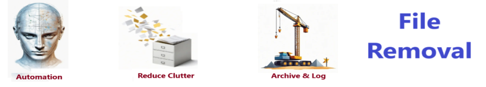

# File Manager - Easily copy, delete, or transfer files

## Description

File Manager - Easily copy, archive, delete, or transfer files

## Features

- copies files
- moves files
- delete files

## Getting Started

To get started with the **Talking Code** project, follow these steps:

1. Clone the repository to your local machine.
2. Install the required dependencies listed at the top of the notebook.
3. Explore the example code provided in the repository and experiment.
4. Run the notebook to hear your code come to life!

 

